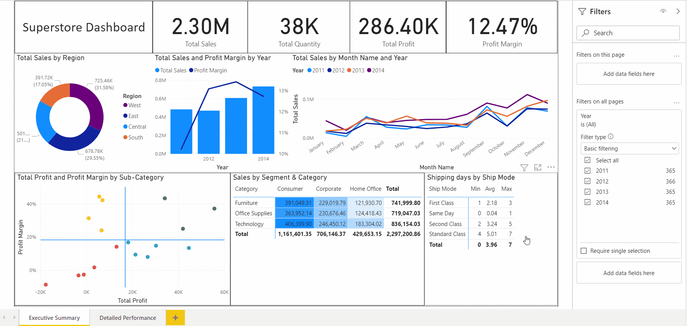
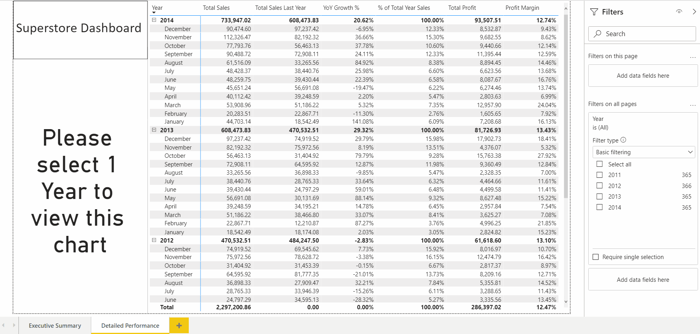
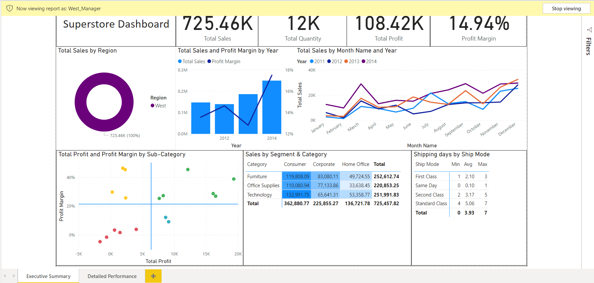

# 📊 Superstore Sales Analytics - Power BI Enterprise Dashboard

## 📌 Project Overview
This project is an end-to-end **Power BI Enterprise Dashboard** designed to analyze the sales performance, profitability, and growth of a retail superstore. 
The primary objective of this project is to demonstrate advanced Power BI capabilities, moving beyond basic data visualization to implement enterprise-level best practices in **Data Modeling, Advanced DAX, Row-Level Security (RLS), and UI/UX optimization**.

## 📂 Data Source
The dataset used in this project is the **Superstore Sales Dataset**, which contains granular transactional data for a retail superstore, including sales, profits, customer segments, and regional performance.
- **Source:** [Kaggle - Superstore Dataset](https://www.kaggle.com/code/rawanma7moud/superstore)

## 🚀 Key Enterprise Features Implemented

- **Data Modeling (Star Schema):** Transformed a flat `.csv` file into a robust Star Schema using Power Query. Separated data into 1 Fact Table (`Fact_Sales`) and multiple Dimension Tables (`Dim_Date`, `Dim_Customer`, `Dim_Product`, `Dim_Location`) to optimize performance and filter context.
- **Advanced DAX & Time Intelligence:** Developed complex DAX measures for business analytics, including Year-to-Date (YTD) Sales, Year-over-Year (YoY) Growth %, and Compound Annual Growth Rate (CAGR).
- **Row-Level Security (RLS):** Implemented dynamic security roles (e.g., `West_Manager`) to restrict data access at the row level, ensuring users only see data relevant to their region.
- **Advanced UX/UI (Conditional Visibility):** Engineered a dynamic "Cover-up" technique using DAX (`HASONEVALUE`) to conditionally hide/show visuals based on slicer selections, enforcing user interaction and preventing misleading data interpretation.
- **Cross-Platform Integration (Proposed Architecture):** Designed an actionable workflow using **Power Automate** to transform the dashboard from a read-only report into an automated tool (e.g., triggering email alerts to regional managers). *(Note: Full hands-on implementation requires an Enterprise Office 365 license, but the conceptual architecture is fully prepared).*

---

## 🏗️ Data Model (Star Schema)


The semantic model follows a strict 1-to-Many relationship architecture, ensuring efficient query performance and accurate filter propagation across the dashboard.

---

## 📈 Dashboard Preview

### 🔹 Executive Summary


### 🔹 Detailed Performance


---

## 💻 Technical Implementation Highlights

### 1. Conditional Visibility (UX/UI Hack)
To ensure the dashboard remains readable and avoids clutter, I implemented a measure that forces the user to select a single year before revealing specific charts.

```dax
Cover Visibility = 
IF(
    HASONEVALUE('Dim_Date'[Year]), 
    "#FFFFFF00",  // 100% Transparent when a single year is selected
    "#FFFFFF"     // Solid white to hide the chart otherwise
)
```

### 2. Time Intelligence (Year-over-Year Growth)
A robust DAX measure handling YoY growth calculations while preventing division-by-zero errors.

```dax
Total Sales Last Year = 
CALCULATE(
    [Total Sales],
    SAMEPERIODLASTYEAR('Dim_Date'[Date])
)

YoY Growth % = 
DIVIDE(
    [Total Sales] - [Total Sales Last Year],
    [Total Sales Last Year],
    0
)
```

### 3. Row-Level Security (RLS) in Action
To ensure data privacy, users can only access data pertaining to their specific region (e.g., the West Manager can only see data for the West region).

<details>
<summary>👀 <b>Click to expand: RLS West Manager View</b></summary>


</details>

---

## 💡 Key Business Insights
*Beyond just building the dashboard, here are the strategic findings extracted from the data:*

1. **Sales vs. Profitability Trends:** While total sales show a positive upward trend from 2011 to 2014, the overall profit margin has fluctuated and ultimately decreased over the same period. This indicates a strong need to investigate cost structures and discount strategies.
2. **Seasonal Sales Patterns & Business Context:** There is a general year-over-year increase with consistent peak sales periods in **March, September, and November**. These recurring spikes likely correlate with specific retail cycles—for instance, September peaks may be driven by "Back to School" or Q3 end-of-quarter pushes, while November marks the beginning of the holiday shopping season. Understanding these underlying seasonal drivers is vital for forecasting demand, preparing inventory, and launching targeted marketing campaigns ahead of time.
3. **Product Portfolio Management (Scatter Plot):** Sub-categories were strategically categorized based on Profit and Margin:
   - **Stars (High Margin & High Profit):** (e.g., *Copiers, Accessories*) Should be maintained and prioritized for further investment.
   - **Growth Opportunities (High Margin & Low Profit):** Strategies to increase sales volume in this quadrant could unlock significant growth.
   - **Careful Monitoring (Low Margin & High Profit):** (e.g., *Phones, Chairs*) Close attention to cost control and potential price adjustments is necessary to maintain profitability.
   - **Review or Discontinuation (Low Margin & Low Profit):** (e.g., *Tables, Bookcases*) These items operate at a loss and require a thorough review to identify opportunities for cost reduction or pricing overhauls.

---

## 🛠️ Tools & Technologies Used
- **Power BI Desktop** (Data Viz, Data Modeling, RLS)
- **Power Query (M Language)** (Data Cleaning & ETL)
- **DAX** (Data Analysis Expressions)
- **Power Automate** (Business Process Automation)

---
*This portfolio project was developed to showcase full-stack Power BI development skills, adhering to Microsoft's enterprise deployment best practices.*
