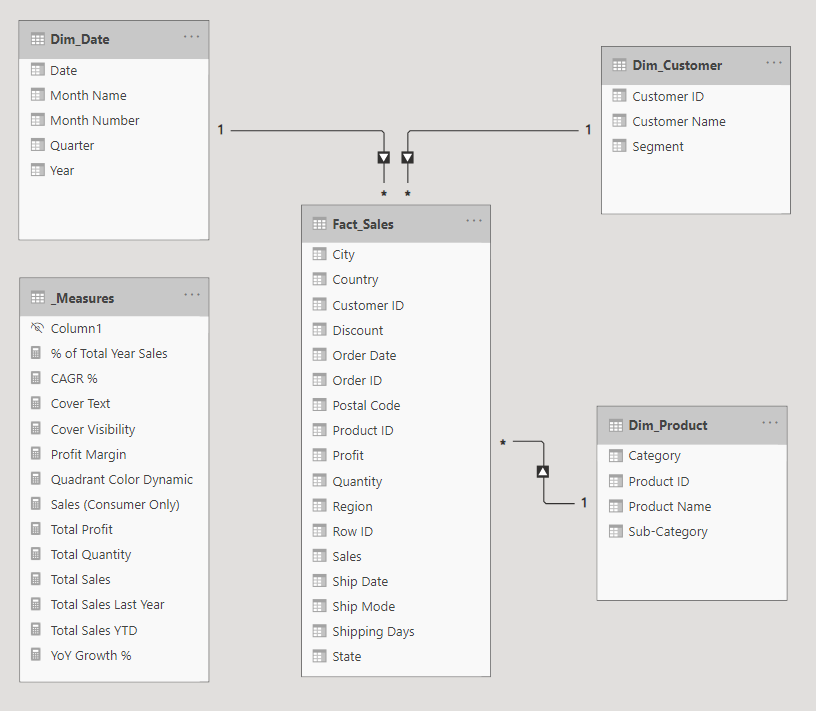

# 📊 Superstore Sales Analytics - Power BI Enterprise Dashboard

## 📌 Project Overview
This project is an end-to-end **Power BI Enterprise Dashboard** designed to analyze the sales performance, profitability, and growth of a retail superstore. 
The primary objective of this project is to demonstrate advanced Power BI capabilities, moving beyond basic data visualization to implement enterprise-level best practices in **Data Modeling, Advanced DAX, Row-Level Security (RLS), and UI/UX optimization**.

## 🚀 Key Enterprise Features Implemented

- **Data Modeling (Star Schema):** Transformed a flat `.csv` file into a robust Star Schema using Power Query. Separated data into 1 Fact Table (`Fact_Sales`) and multiple Dimension Tables (`Dim_Date`, `Dim_Customer`, `Dim_Product`, `Dim_Location`) to optimize performance and filter context.
- **Advanced DAX & Time Intelligence:** Developed complex DAX measures for business analytics, including Year-to-Date (YTD) Sales, Year-over-Year (YoY) Growth %, and Compound Annual Growth Rate (CAGR).
- **Row-Level Security (RLS):** Implemented dynamic security roles (e.g., `West_Manager`) to restrict data access at the row level, ensuring users only see data relevant to their region.
- **Advanced UX/UI (Conditional Visibility):** Engineered a dynamic "Cover-up" technique using DAX (`HASONEVALUE`) to conditionally hide/show visuals based on slicer selections, enforcing user interaction and preventing misleading data interpretation.
- **Cross-Platform Integration (Actionable Dashboard):** Integrated **Power Automate** directly into the dashboard, transforming it from a read-only report into an actionable tool (e.g., triggering email alerts to regional managers).

---

## 🏗️ Data Model (Star Schema)
*(💡 Tip for you: Take a screenshot of your Power BI Model View, upload it to your GitHub repo, and replace the filename below)*


The semantic model follows a strict 1-to-Many relationship architecture, ensuring efficient query performance and accurate filter propagation across the dashboard.

---

## 📈 Dashboard Preview
*(💡 Tip for you: Take a screenshot or create a GIF of your Dashboard in action and replace the filename below)*


---

## 💻 Technical Implementation Highlights

### 1. Conditional Visibility (UX/UI Hack)
To ensure the dashboard remains readable and avoids clutter, I implemented a measure that forces the user to select a single year before revealing specific charts.

```dax
Cover Visibility = 
IF(
    HASONEVALUE('Dim_Date'[Year]), 
    "#FFFFFF00",  // 100% Transparent when a single year is selected
    "#FFFFFF"     // Solid white to hide the chart otherwise
)
```

### 2. Time Intelligence (Year-over-Year Growth)
A robust DAX measure handling YoY growth calculations while preventing division-by-zero errors.

```dax
Total Sales Last Year = 
CALCULATE(
    [Total Sales],
    SAMEPERIODLASTYEAR('Dim_Date'[Date])
)

YoY Growth % = 
DIVIDE(
    [Total Sales] - [Total Sales Last Year],
    [Total Sales Last Year],
    0
)
```

---

## 🛠️ Tools & Technologies Used
- **Power BI Desktop** (Data Viz, Data Modeling, RLS)
- **Power Query (M Language)** (Data Cleaning & ETL)
- **DAX** (Data Analysis Expressions)
- **Power Automate** (Business Process Automation)

---
*This portfolio project was developed to showcase full-stack Power BI development skills, adhering to Microsoft's enterprise deployment best practices.*
